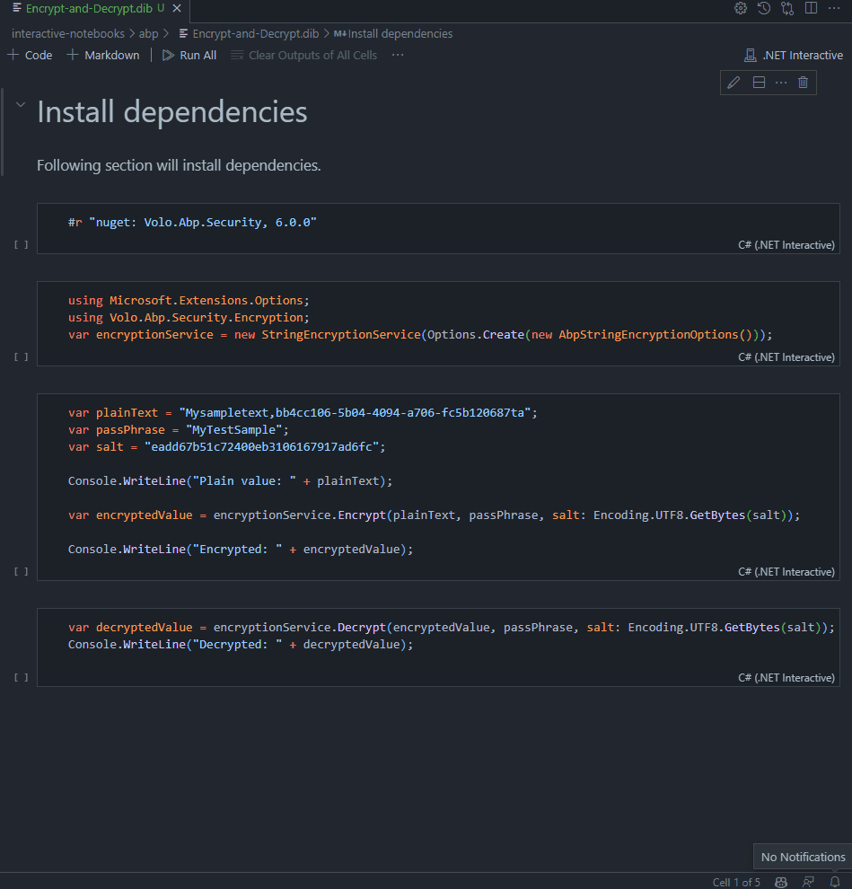

# notebook
 This repository includes interactive notebook samples

## Usage
Before you start, you need to install the following VS Code Extension

- [.NET Interactive Notebooks](https://marketplace.visualstudio.com/items?itemName=ms-dotnettools.dotnet-interactive-vscode)

Then you're ready to open `.ipyng` and `dib` files in VS Code.

## Example

Open the `interactive-notebooks/abp/Encrypt-and-Decrypt.dib` file in VS Code, and git the `Run All` button at the top of the page and run all of the code cells.

